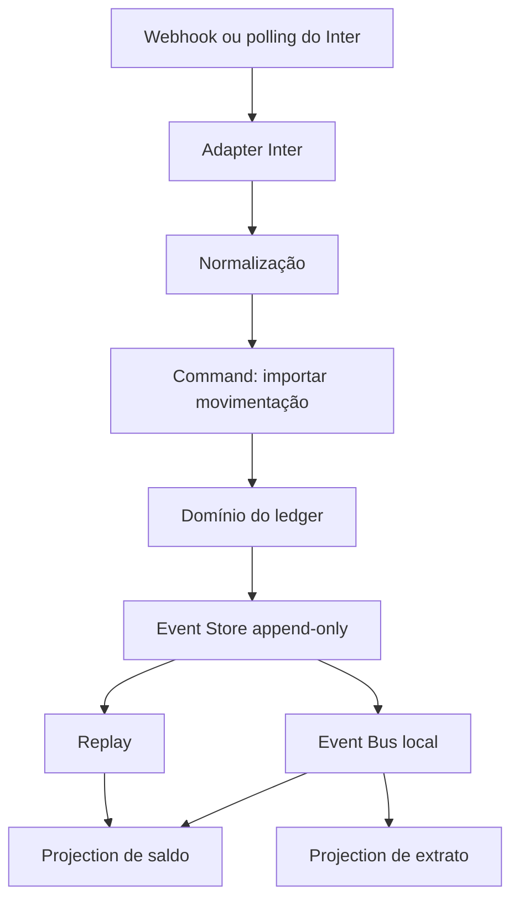

# Arquitetura do laboratório

O projeto começa como um monólito modular. O objetivo é tornar os conceitos observáveis antes de distribuir o sistema.

## Os três conceitos no projeto

### Event-Driven

O domínio publica fatos, como `PixReceived` e `LedgerTransactionPosted`. Nesta primeira etapa o barramento é síncrono e em memória. Isso ensina o fluxo sem esconder a ideia atrás de Kafka.

Mais tarde, o `LocalEventBus` poderá ser substituído por uma implementação baseada em Outbox + broker. O contrato do domínio não deve depender de Kafka.

### CQRS

O comando `importTransaction` valida e grava fatos. A consulta de saldo lê `BalanceProjection`, que é um modelo separado e derivado dos eventos.

CQRS aqui significa separar responsabilidades e modelos; não significa obrigatoriamente dois bancos ou dois serviços.

### Event Sourcing

O estado da projeção não é a fonte de verdade. A fonte é o histórico de eventos no `EventStore`. A projeção pode ser apagada e reconstruída por replay.

O ledger continua sendo uma estrutura própria: ele guarda lançamentos contábeis em partidas dobradas. Nem todo evento precisa gerar dinheiro no ledger.

## Limites importantes

- O JSON do Inter fica no adapter; o domínio recebe `InterTransaction`.
- Um identificador externo é a chave de idempotência. A implementação real deverá reforçar isso com uma constraint única no PostgreSQL.
- Webhook e polling podem entregar a mesma operação. Ambos passam pelo mesmo caso de uso.
- O Event Store em memória é deliberadamente didático; ele será substituído por PostgreSQL quando os invariantes estiverem claros.
